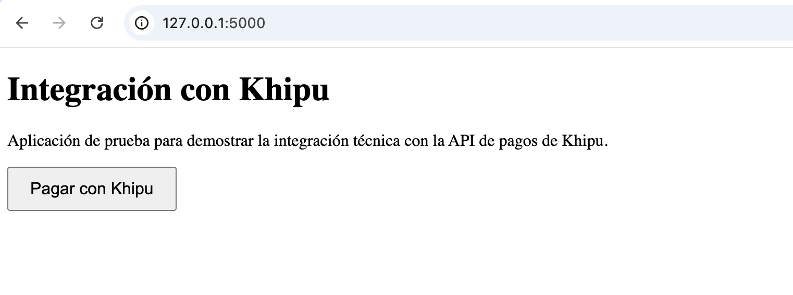
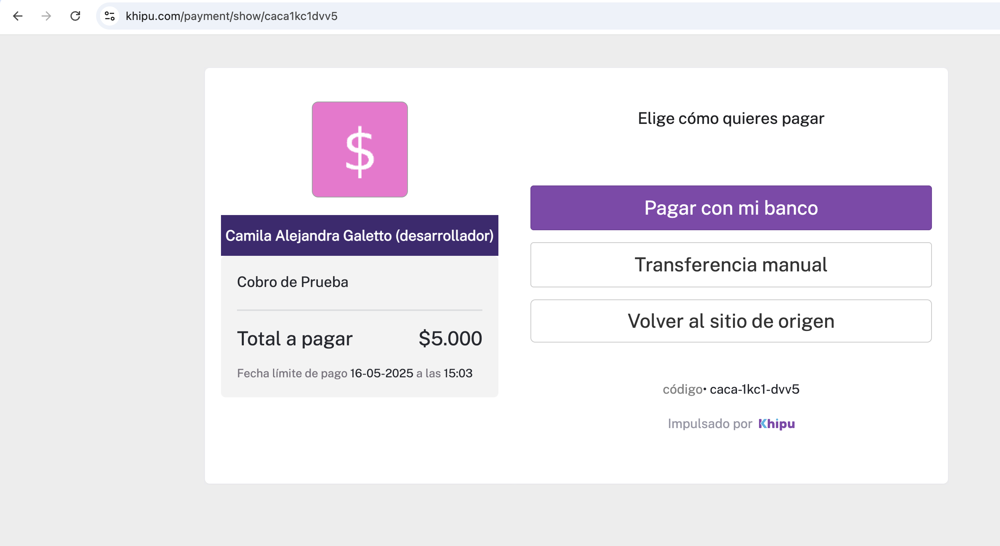
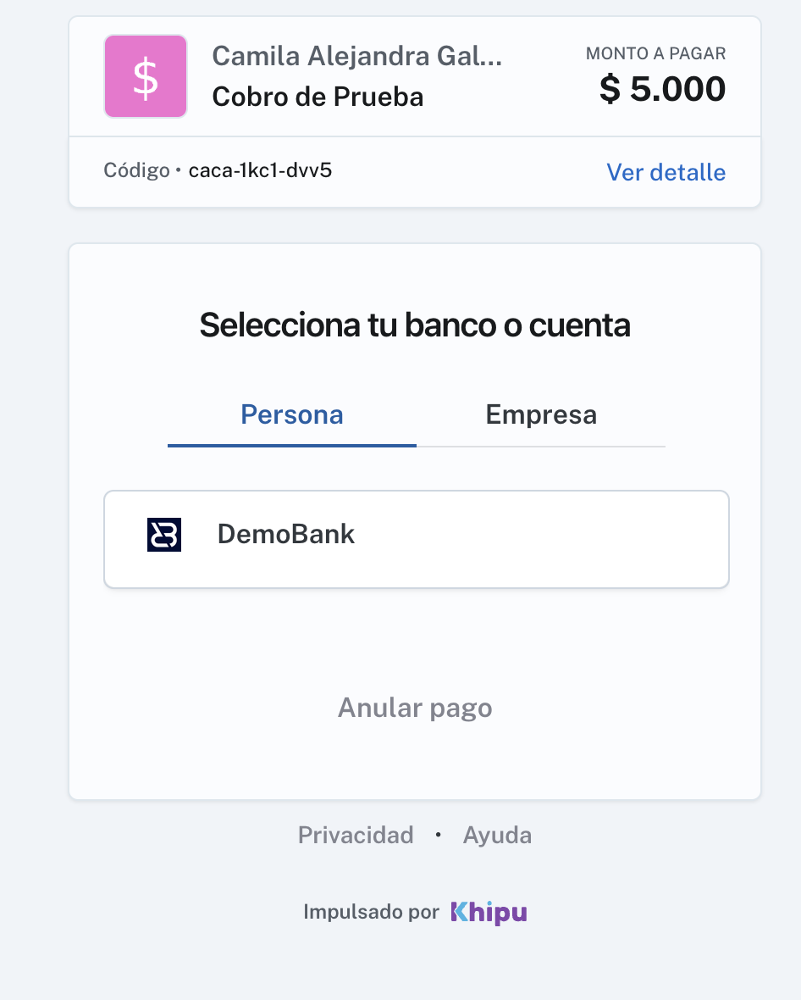
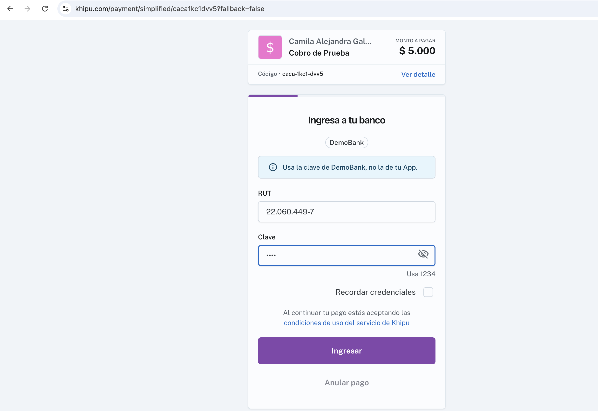
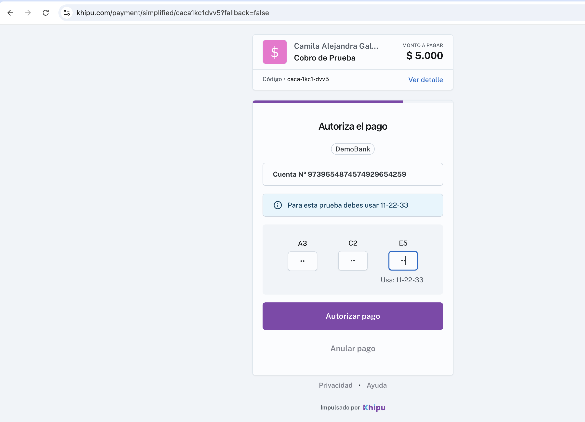
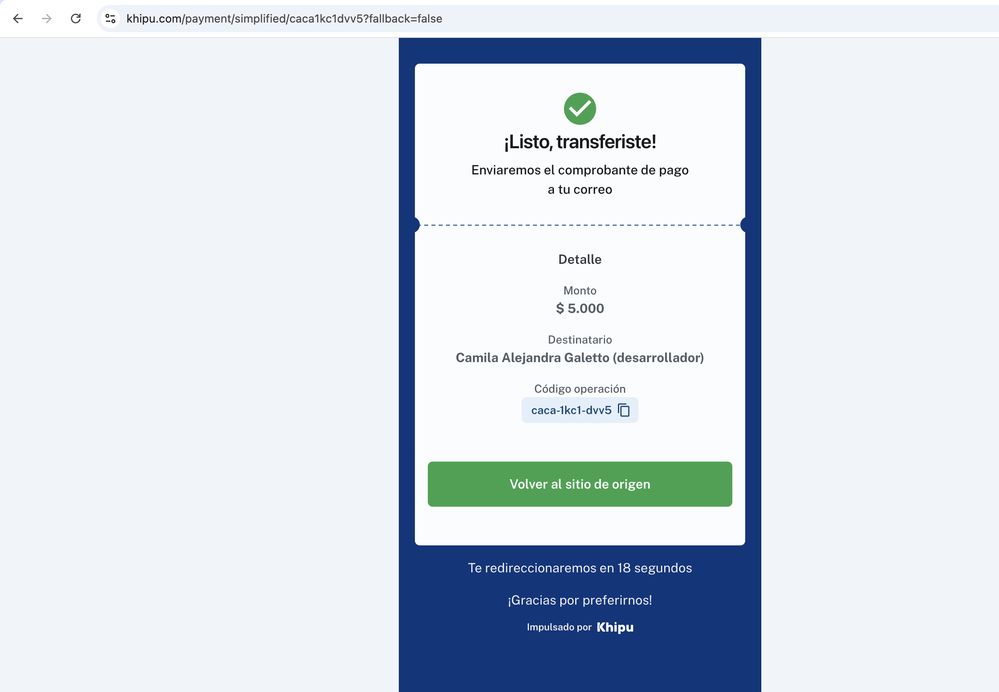
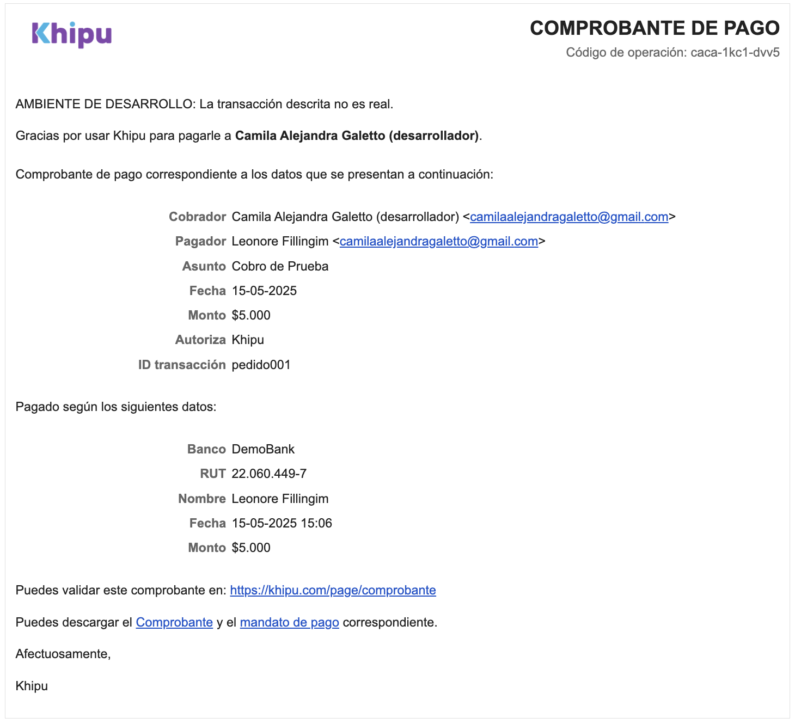

# 💸 Integración de pagos con la API de Khipu

Este proyecto fue desarrollado como parte de un desafío técnico para integrar la **API REST v3 de Khipu**, simulando un flujo de cobro real en entorno de pruebas (**Demobank**), sin intervención manual desde el portal.

Toda la integración fue realizada mediante código utilizando **Python y Flask**.

---

## 🚀 Tecnologías utilizadas

- Python 3.13  
- Flask  
- requests  
- HTML5  
- Git + GitHub  

---

## 🔐 Seguridad

Se utiliza un archivo `.env` (ignorado en Git) para proteger la API Key de Khipu:

```env
API_KEY=tu_clave_privada
```

En el código, la clave se importa desde este archivo usando `python-dotenv` (puede instalarse si se desea robustecer):

```python
import os
from dotenv import load_dotenv

load_dotenv()
API_KEY = os.getenv("API_KEY")
```

---

## 📸 Proceso de integración

A continuación se muestra el paso a paso visual de la integración:

### 1. Inicio del flujo


### 2. Generación del cobro


### 3. Redirección al entorno de pago


### 4. Simulación de pago en Demobank


### 5. Confirmación del pago


### 6. Mensaje de éxito al usuario


### 7. Flujo de cancelación


---

## ▶️ Cómo ejecutar localmente

```bash
# Crear entorno virtual
python3 -m venv env
source env/bin/activate  # Mac/Linux
env\Scripts\activate     # Windows

# Instalar dependencias
pip install flask requests python-dotenv

# Ejecutar la app
python app.py
```

---

## ✍️ Autor

Camila Galetto  
💼 [GitHub](https://github.com/camigaletto)  
